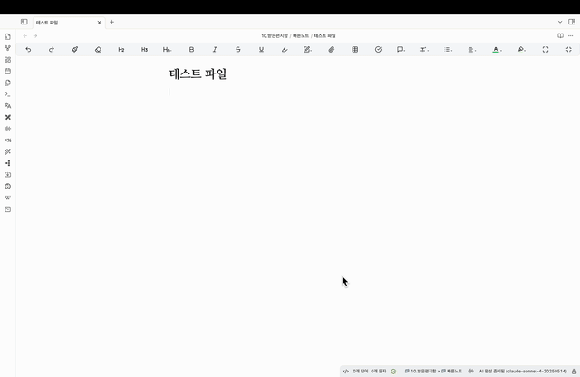

# AI Writing Assistant (Korean)

Cursor AI의 탭 기능을 커스터마이징하여 만든 옵시디언 플러그인입니다. 타이핑 중 잠깐 멈추면 AI가 자동으로 문맥을 파악해서 다음에 올 글을 미리 보여줍니다.

영어 버전을 설치하려면 여기로:
https://github.com/reaboyki/ai_writing_assistant_eng

## 주요 기능

### 자동 텍스트 예측
타이핑하다가 잠깐 멈추면 AI가 자동으로 이전과 이후(있다면) 문맥을 파악해서 다음에 올 글을 회색글씨로 미리 보여줍니다.

### 간편한 조작
- **수락**: 마음에 들면 키보드 방향키 `→` 누르기
- **무시**: 마음에 안 들면 그냥 계속 타이핑하거나 `ESC` 누르기

## 설치 방법

1. Obsidian 설정에서 "커뮤니티 플러그인" 탭으로 이동
  2. "안전 모드" 해제 (아직 해제하지 않은 경우)
  3. 이 저장소를 다운로드하거나 클론
  4. Obsidian 볼트 폴더 내 .obsidian/plugins/ 디렉토리에 플러그인 폴더 복사
  5. Obsidian 재시작 또는 설정에서 "플러그인 새로고침"
  6. 커뮤니티 플러그인 목록에서 "AI Writing Assistant" 활성화

## 사용 방법

1. 플러그인 설치 후 활성화
2. 텍스트 입력 중 잠깐 멈추기
3. AI가 제안하는 회색 텍스트 확인
4. 방향키 `→`로 수락 또는 `ESC`/계속 타이핑으로 무시

## 특징

- **Tab 키 대신 방향키 사용**: 옵시디언에서 Tab 키 누를 시 들여쓰기를 막기가 어려워 방향키 `→`를 사용합니다.
- **다양한 AI 모델 지원**: 여러 AI 모델을 선택하여 사용할 수 있습니다.
- **사용량 통계**: 대략적인 추정치를 제공합니다 (정확한 요금은 각 API 제공 대시보드에서 확인하세요).
- **커스터마이징 가능**: 다양한 설정을 통해 사용자 환경에 맞게 조절할 수 있습니다.

## 파일 구조

- `manifest.json`: 설정 파일
- `main.js`: 핵심 기능 구현
- `AI_Writing_Assistant_사용자가이드.md`: 자세한 사용 가이드

## 주의사항

- **처음 만든 플러그인**이라 부족한 점이 많습니다. 개선할 점이나 오류가 있을 경우 말씀해주시면 감사하겠습니다.
- **추론 모델 응답 속도**: 추론 모델들의 경우 답변이 상당히 느립니다 (약 7초~십몇초). 빠른 답변을 원하시면 최신 모델들 말고 비추론 모델을 사용하는 것을 추천드립니다.

Created by [reaboyki](https://github.com/reaboyki)
